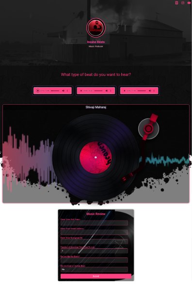

# Insane Beats Website

## Preview

## Overview

- This website allows users to listen to beats that I/Admin upload and add their reviews.
- Admin can add optional questions in the review form dynamically through website.
- The review form currently includes a main question about whether users want to collaborate with me. If they choose to collaborate, additional questions about the type of collaboration they are interested in will appear.
- A mail will be sent to me on a successfull review submission so that I cannot miss any feedback.

## Technologies Used

- **MongoDB**
- **Express**
- **React**
- **Node.js**

## Contributed By

<table>
  <tbody>
    <tr>
      <td align="center" valign="top" width="14.28%"><a href="https://github.com/Devesh007suii"> <b>Devesh Sharma</b></a></td>
      <td align="center" valign="top" width="14.28%"><a href="https://github.com/PiyushPamnani"> <b>Piyush Pamnani</b></a></td>
    </tr>
  </tbody>
</table>
